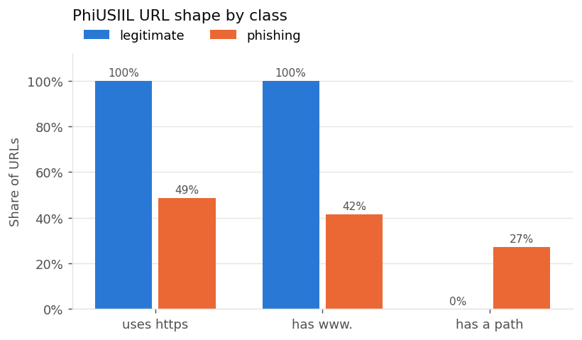
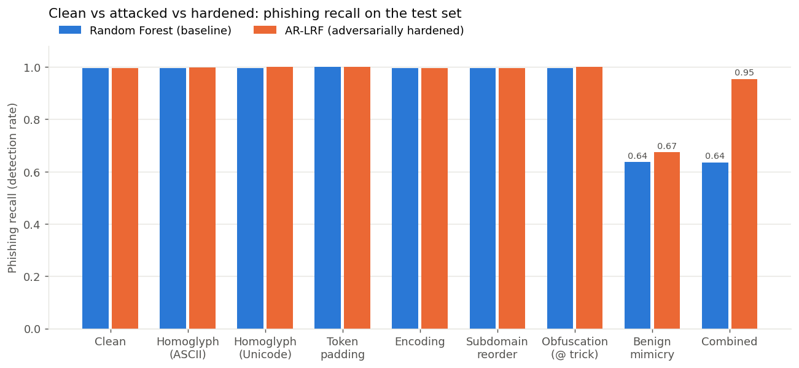
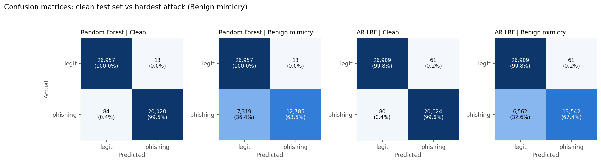
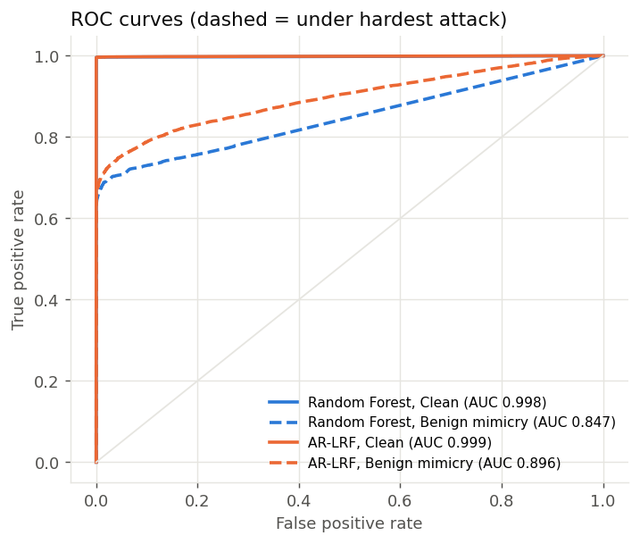
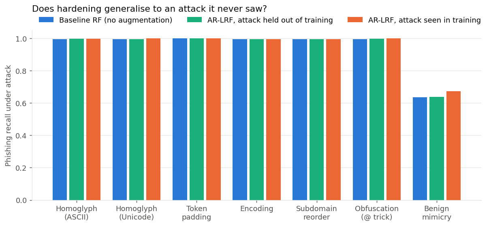
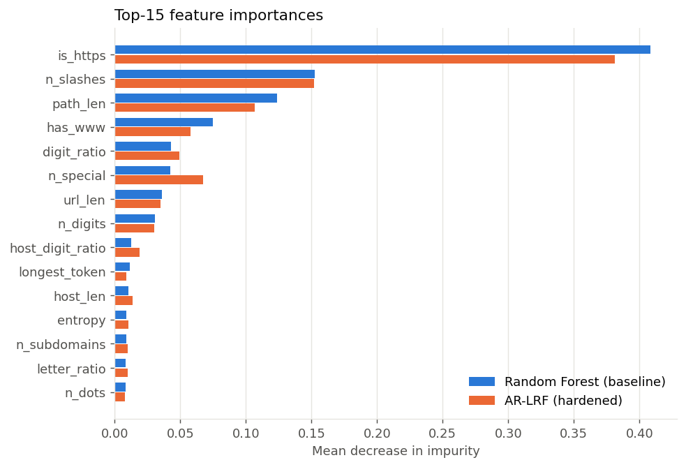

| | | | |
|---|---|---|---|
| **COURSE CODE:** | DJS23ILPC502 | **DATE:** | `<DD/MM/YYYY>` |
| **COURSE NAME:** | Artificial Intelligence Laboratory | **CLASS:** | T. Y. B. Tech |
| **NAME 1:** | `<Name>` | **SAP ID 1:** | `<SAP ID>` |
| **NAME 2:** | `<Name>` | **SAP ID 2:** | `<SAP ID>` |

# EXPERIMENT NO. 10

**CO/LO:** Interpret intelligent systems for problem solving.

**AIM / OBJECTIVE:** Implementation of any AI game/Usecase: Wumpus world, Tic-tac-toe, 8-Queens Problem.

---

## DESCRIPTION OF EXPERIMENT

Artificial Intelligence (AI) is the field of computer science that aims to create systems capable of performing tasks that normally require human intelligence. These tasks include learning from data, reasoning, problem-solving, perception, and natural language understanding.

AI applications have revolutionized many sectors, including healthcare, finance, transportation, and education, by enabling automation, intelligent decision-making, and data-driven insights.

AI models can significantly improve real-world processes by:

- Automating decision-making based on data analysis and pattern recognition.
- Enhancing accuracy and efficiency through predictive analytics.
- Reducing human error and enabling 24/7 intelligent operations.
- Providing adaptive learning capabilities, allowing systems to improve over time.

**Research Paper Study:**

- Choose a recent research paper or technical article on AI applications (examples: medical image diagnosis, sentiment analysis, autonomous driving, recommendation systems, or fraud detection).
- Study and analyze the paper to understand:
  - The problem statement being addressed.
  - The AI approach or algorithm used (e.g., neural networks, decision trees, reinforcement learning).
  - The data sources, model architecture, and evaluation metrics.

**Conceptual Understanding:**

- Summarize the key components of the AI system described in the paper.
- Identify the critical modules or algorithms that can be implemented practically (such as data preprocessing, feature extraction, model training, or prediction).

**Module Implementation:**

- Based on the research, design and implement a simplified AI model that replicates one key function or feature of the paper.
- Choose a suitable dataset (e.g., from Kaggle, UCI Machine Learning Repository, or synthetic data).
- Implement the AI model using Python and a suitable framework like TensorFlow, PyTorch, or Scikit-learn.

**Testing & Demonstration:**

- Evaluate your model using test data and appropriate performance metrics (accuracy, precision, recall, F1-score, etc.).
- Visualize and interpret results using confusion matrices, ROC curves, or loss/accuracy plots.
- Demonstrate the model's predictions and discuss its limitations.

---

## RESEARCH PAPER ANALYSIS

**Title:** "Adversarial-resilient lightweight phishing URL detection: Evaluating lexical & metadata features under evasion techniques"

**Authors:** Ayan Chaudhuri and Mohankumar B, School of Computer Science and Engineering (SCOPE), Vellore Institute of Technology, Vellore, India.

**Published in:** *Scientific Reports* (Nature Portfolio), Vol. 16, Article 26668, 2026. DOI: 10.1038/s41598-026-60046-3

We chose this paper for three reasons:

1. **It is recent and peer-reviewed.** It was published in 2026 in a Nature Portfolio journal.
2. **It addresses a real gap.** Most phishing detectors report about 99% accuracy but are tested only on *clean* URLs. This paper asks what happens when an attacker deliberately modifies the URL to evade detection. That gives a concrete, measurable experiment: clean vs. attacked vs. hardened.
3. **It can be implemented practically.** The model is a Random Forest on hand-crafted URL features, so its core idea can be reproduced with Scikit-learn on a laptop, with no GPU or web crawling.

### Problem statement addressed

Phishing is the most common cyber threat because it is both psychologically and technically easy. Attackers send fraudulent links through email, social media or spoofed websites to steal credentials or install malware. The paper cites an RSA (2013) report: more than **450,000 phishing attacks in one year, causing losses of about USD 5.9 billion**.

Existing defences have three weaknesses:

- **Blacklists and rule-based filters are reactive.** They only block URLs that are already known to be malicious. Attackers bypass them with minimal textual changes such as character replacement, random tokens or URL shorteners.
- **Classical ML detectors** (Logistic Regression, Decision Tree, Random Forest, SVM, KNN) learn from fixed datasets and assume the data distribution never changes. Small structural perturbations, such as replacing `google` with `g00gle` or reordering subdomains, can sharply reduce their accuracy.
- **Deep learning detectors** (CNN-LSTM, attention models, BERT) are more accurate but computationally expensive. That limits their use in real-time and resource-constrained settings such as email gateways, browser extensions, mobile devices and IoT nodes.

The paper's central claim is that **most existing models are evaluated only under clean conditions and ignore adversarial URL evasion.** Few works combine lightweight deployment, adversarial robustness and interpretability in one reproducible framework.

The problem is formulated as **binary classification**. Given a feature vector *x* ∈ ℝᵈ extracted from a URL, learn *f(x) → y*, where *y* ∈ {0 = benign, 1 = phishing}. The decision confidence is *P(y = 1 | x) = σ(f(x))*.

**Threat model:**

- **Attacker:** can modify the URL string freely, as long as the malicious purpose and redirection still work.
- **Defender:** restricted to URL-based features only. Web-page rendering, deep packet inspection (DPI) and external content fetching are deliberately excluded to keep the detector lightweight and real-time.

**Objectives stated by the authors:**

1. Design a lightweight ML model using lexical and metadata features for efficient phishing URL detection.
2. Model realistic evasion techniques: homoglyph substitution, token padding, subdomain manipulation and encoding-based obfuscation.
3. Incorporate adversarial training and evaluate robustness with F1-score and Robust-AUC.
4. Evaluate on a large dataset that reflects real-world class imbalance.
5. Integrate explainability (feature importance) for interpreting predictions.

### AI approaches / algorithms used

The proposed model is the **Adversarial-Resilient Lightweight Random Forest (AR-LRF)**.

**1. Random Forest backbone.** A Random Forest is an ensemble of decision trees. Each tree is trained on a bootstrap sample of the data and considers a random subset of features at each split. The final prediction is a majority vote. The authors chose it because:

- it performs well on tabular features;
- inference is cheap;
- it tolerates noisy feature distributions better than a linear model;
- it captures non-linear interactions between features;
- it gives feature importances for interpretability.

**2. Controlled ensemble complexity.** To keep the model lightweight:

- the tree depth is bounded (*max depth = 16*);
- a minimum leaf size is enforced so the trees do not over-specialise on training patterns;
- **class-balanced learning** keeps the decision boundary stable despite the 91:9 class imbalance.

**3. Adversarial training (the key idea).** Baselines are trained only on clean URLs. AR-LRF is trained on a **mixture of clean and adversarially perturbed samples**, so it learns decision boundaries that still hold when an attacker shifts the feature distribution. Adversarial samples are generated in two ways:

- **URL-level transformations (the main method).** The raw URL string is modified, then passed through the same feature extractor again, so the adversarial effect shows up realistically in the features:

  | Evasion technique | Example from the paper | Features affected |
  |---|---|---|
  | Homoglyph substitution | `google.com` → `g00gle.com` | digit count, entropy |
  | Token padding | `/login` → `/login-secure-update` | URL length, special characters, entropy |
  | Subdomain manipulation | `secure.bank.com` → `bank.secure-login.com` | structural features |
  | Encoding-based obfuscation | `/login` → `%2Flogin`, or Unicode substitutions | hex encoding, Unicode usage |

- **Bounded feature-level noise (used for sensitivity analysis).** Each feature is scaled by a random factor:

  *x′ = x · (1 + ε)*, with *ε ~ U(−δ, δ)* and *δ = 0.1*.

  The perturbation is limited by the constraint *‖x′ − x‖₂ ≤ τ*, with *τ = 0.5*. This keeps adversarial samples realistic, so they are not impossible distortions of a URL.

**4. Joint decision-risk objective.** The authors frame AR-LRF as balancing three goals:

*R(x) = λ₁·L_cls(x, y) + λ₂·L_adv(x, x′) + λ₃·C(x)*

- *L_cls* is the classification loss.
- *L_adv* is an adversarial consistency loss: predictions on *x* and its perturbed copy *x′* should agree.
- *C(x)* is the computational cost.
- λ₁, λ₂ and λ₃ set the trade-off between accuracy, robustness and efficiency.

**Overall pipeline** (the paper's "perception–decision pipeline"):

```
Raw URL → feature extraction (lexical + structural + metadata) → preprocessing
        → adversarial augmentation (URL-level transforms + bounded noise)
        → bounded Random Forest ensemble (300 trees, depth 16, class-balanced)
        → P(phishing) → benign / phishing decision
```

### Representative datasets / data sources mentioned

| Attribute | Value |
|---|---|
| Total URLs | 650,000 (after removing duplicate, inactive and malformed URLs) |
| Benign URLs | 591,500 (91%), from the **Alexa** and **Tranco** top-domain lists |
| Phishing URLs | 58,500 (9%), from **OpenPhish** and **PhishTank** |
| Collection period | 2024 |
| Class distribution | Deliberately imbalanced, to reflect real web traffic (most papers use an artificial 50:50 split) |
| Model input | Numerical features only; raw URLs are kept for feature extraction and auditing only |
| Privacy | No personally identifiable information; only publicly accessible URLs |
| Availability | On request from the corresponding author (not public) |

Raw URL strings are never fed to the model. This prevents it from memorising specific domain names or brands and forces it to learn general phishing patterns.

The paper's summary statistics (Table 7) show that phishing URLs are:

- longer: mean length **88.9 vs 63.8** characters;
- more random: entropy **4.03 vs 3.47**;
- more digit-heavy: **6.58 vs 2.41** digits on average.

The class distributions overlap considerably, though, so the task is not trivially separable.

**Feature set.** There are 12 features in three groups, each rated by how easily an attacker can manipulate it (Table 3):

| Feature | Category | Description | Attack sensitivity |
|---|---|---|---|
| URL length | Lexical | Total characters in the URL | Medium |
| Digit count | Lexical | Number of numeric characters | Medium |
| Special characters | Lexical | Count of special symbols | Medium |
| Entropy | Lexical | Character randomness, *H = −Σ pᵢ log pᵢ*, min–max normalised | Medium |
| HTTPS presence | Structural | Secure-protocol indicator | Low |
| IP-based URL | Structural | IP address instead of a domain name | Low |
| Redirect count | Structural | Number of redirections | Medium |
| Hex encoding | Encoding | Hexadecimal characters present | High |
| Unicode usage | Encoding | Unicode obfuscation | High |
| Domain age | Metadata | Days since domain registration | High |
| Alexa rank | Metadata | Website popularity | High |
| TLD | Metadata | Top-level domain | Medium |

### Model architecture & training strategies

**Baselines compared (Table 4):**

| Model | Key hyperparameters | Features | Adversarial augmentation |
|---|---|---|---|
| Logistic Regression | max iterations = 2000 | Lexical + Structural | No |
| Decision Tree | max depth = 8 | Lexical + Structural | No |
| Random Forest | 200 trees, max depth = 12 | Lexical + Structural | No |
| SVM (RBF kernel) | probability outputs enabled | Lexical + Structural | No |
| Gaussian Naïve Bayes | Gaussian assumption | Lexical only | No |
| RF-Full | 200 trees, max depth = 12 | Lexical + Structural + Metadata | No |
| RF-Full + Adv | 200 trees, max depth = 12 | Lexical + Structural + Metadata | Yes |
| **AR-LRF (proposed)** | **300 trees, max depth = 16** | **Lexical + Structural + Metadata** | **Yes** |

RF-Full + Adv is a "fairness" baseline. It uses the same features and the same adversarial augmentation as AR-LRF, so any remaining gap cannot be explained by richer features or augmentation alone.

**Training and validation protocol:**

- 80/20 stratified train–test split, so both sets keep the 91:9 class ratio.
- **5-fold cross-validation**, reported as mean ± standard deviation.
- Fixed random seeds for reproducibility.
- Duplicate URLs and duplicate domain-level records removed *before* splitting, to avoid data leakage.
- Training set = clean samples + adversarial samples (Algorithm 1 in the paper).

### Evaluation metrics commonly used

**Detection quality:**

- **Accuracy** = (TP + TN) / (TP + TN + FP + FN)
- **Precision** = TP / (TP + FP): how reliable a "phishing" prediction is.
- **Recall** = TP / (TP + FN): the share of phishing URLs actually caught.
- **F1-score** = 2PR / (P + R)
- **ROC-AUC**: ranking quality across all thresholds.
- **Matthews Correlation Coefficient (MCC)**: uses all four cells of the confusion matrix, so it is more reliable under class imbalance.

**Security-specific errors:**

- **FPR** = FP / (FP + TN): false alarms on benign URLs.
- **FNR** = FN / (FN + TP): missed phishing URLs.

**Robustness:**

- **Accuracy degradation**, Δ_robust = (Acc_clean − Acc_adv) / Acc_clean.
- Robust-AUC, and **probability (confidence) stability** between clean and attacked inputs.

**Significance and efficiency:**

- **McNemar's test** between the best baseline and AR-LRF.
- Training time, inference latency (ms per URL), model size, memory footprint and throughput (URLs per second).

### Key results reported in the paper

**Clean test set (Table 8 and Table 8a):**

| Model | Accuracy | Precision | Recall | F1 | ROC-AUC |
|---|---|---|---|---|---|
| Logistic Regression | 0.9685 | 0.9761 | 0.9605 | 0.9682 | 0.9950 |
| Decision Tree | 0.9846 | 0.9987 | 0.9705 | 0.9844 | 0.9955 |
| Random Forest | 0.9892 | 0.9964 | 0.9820 | 0.9892 | 0.9983 |
| SVM (RBF) | 0.9799 | 0.9913 | 0.9683 | 0.9796 | 0.9950 |
| Naïve Bayes | 0.9355 | 0.9148 | 0.9605 | 0.9371 | 0.9902 |
| RF-Full | 0.9918 | 0.9971 | 0.9865 | 0.9917 | 0.9989 |
| RF-Full + Adv | 0.9946 | 0.9978 | 0.9914 | 0.9945 | 0.9994 |
| **AR-LRF** | **0.9978** | **0.9985** | **0.9970** | **0.9977** | **0.9999** |

5-fold cross-validation gives AR-LRF **0.997 ± 0.001**, against 0.989 ± 0.002 for Random Forest. McNemar's test between Random Forest and AR-LRF gives **p < 0.01**, so the improvement is statistically significant.

**Ablation (Table 9).** Removing adversarial augmentation from AR-LRF lowers accuracy from 0.9978 to 0.9918, F1 from 0.9977 to 0.9916, and ROC-AUC from 0.9999 to 0.9979.

**Under adversarial evasion (Table 11).** This is the paper's main result:

| Model | Clean accuracy | Adversarial accuracy | Drop |
|---|---|---|---|
| Logistic Regression | 0.9685 | 0.812 | −15.65% |
| Decision Tree | 0.9846 | 0.742 | −24.26% |
| Random Forest | 0.9892 | 0.768 | −22.12% |
| SVM (RBF) | 0.9799 | 0.835 | −14.49% |
| **AR-LRF** | **0.9978** | **0.932** | **−6.58%** |

The baselines lose 14–24 percentage points under attack; AR-LRF loses about 6.6.

**Sensitivity to perturbation strength (Table 6a).** AR-LRF's accuracy falls gradually as δ increases:

| δ | 0.05 | 0.10 | 0.15 | 0.20 |
|---|---|---|---|---|
| Adversarial accuracy | 96.8% | 93.2% | 90.4% | 87.1% |
| Degradation | 2.98% | 6.58% | 9.40% | 12.71% |

**Computational cost (Table 14):**

| Model | Training time | Inference | Model size | Memory | Throughput |
|---|---|---|---|---|---|
| Random Forest | 6.5 s | 0.18 ms/URL | 7.8 MB | 64 MB | 5,556 URLs/s |
| SVM (RBF) | 9.2 s | 0.24 ms/URL | 12.6 MB | 82 MB | 4,167 URLs/s |
| **AR-LRF** | 8.1 s | **0.21 ms/URL** | 9.4 MB | 71 MB | **4,762 URLs/s** |

AR-LRF is not the smallest model; Naïve Bayes and Logistic Regression are under 0.1 MB. It is lightweight in the sense of fast inference with no heavy components (no DPI, no deep feature extraction, no page rendering), which suits email gateways, browser extensions and network appliances.

**Error analysis.**

- Baseline models mostly failed on phishing URLs that **imitate benign structure**: moderate length, low entropy, valid HTTPS.
- AR-LRF handles these better, but borderline cases with overlapping entropy remain difficult.
- AR-LRF's wrong predictions usually come with **low confidence**, so the model is rarely "confidently wrong", which matters in security applications.

**Comparison with prior work (Table 10).** AR-LRF reaches 0.9978 accuracy, against:

- 0.99 for a BERT model (Elsadig et al., 2022);
- 0.985 for a hybrid CNN-ML pipeline (Nagy et al., 2023);
- 0.988 for an explainable ML model (Wang, 2025).

AR-LRF reaches this at a fraction of the computational cost.

### Summary of key components of the AI system

| Component | Role in the system |
|---|---|
| Data collection and cleaning | Merges phishing feeds (OpenPhish, PhishTank) and benign top-site lists (Alexa, Tranco); removes duplicates and malformed URLs |
| Feature extraction | Converts each URL into 12 numerical lexical, structural/encoding and metadata features |
| Adversarial sample generator | Applies homoglyph, padding, subdomain and encoding transformations to raw URLs, then re-extracts features; adds bounded feature noise (δ, τ) |
| AR-LRF classifier | Bounded, class-balanced Random Forest (300 trees, depth 16) trained on clean + adversarial samples |
| Robustness evaluation | Compares metrics on clean and attacked test data, perturbation-strength sensitivity, confidence stability, McNemar's test |
| Interpretability | Feature-importance analysis and feature-level case studies of misclassifications |

**Critical modules that can be implemented practically:**

1. **Data preprocessing:** cleaning, labelling, stratified split.
2. **Lexical feature extraction** from the URL string.
3. **URL-level evasion functions:** homoglyph, token padding, subdomain reordering, encoding.
4. **Random Forest training**, both baseline and adversarially augmented.
5. **Robustness evaluation:** clean vs. attacked metrics, confusion matrices, ROC curves.

Our implementation covers modules 1–5 on the public PhiUSIIL dataset (UCI #967), because the paper's 650k-URL dataset is not publicly available. We used only lexical features, so the metadata features (domain age, Alexa rank) are not replicated.

### Critical observations on the paper

- **No per-attack breakdown.** The adversarial results in Table 11 are reported as a single accuracy figure. They do not show how much each evasion technique (homoglyph, padding, subdomain, encoding) hurts on its own, so the most dangerous attack cannot be identified from the paper.
- **The model comparison is not equal-capacity.** AR-LRF uses 300 trees of depth 16, while the "fair" RF-Full + Adv baseline uses 200 trees of depth 12. Part of AR-LRF's advantage may simply come from a larger model rather than the training framework.
- **Coincident numbers.** The headline URL-level adversarial accuracy (93.2%, −6.58%) is identical to the feature-noise sensitivity result at δ = 0.10. The paper does not explain how two different attack procedures produced the same figure.
- **The metadata features are not purely URL-based.** Domain age and Alexa rank require external WHOIS and ranking lookups, and the paper itself rates them "highly sensitive" to manipulation. Alexa rankings were also retired in 2022.
- **Limited reproducibility.** The dataset is available only on request, and the λ coefficients of the risk objective are not given.
- **The authors' own limitations.** Evaluation uses cross-validation rather than a temporally separated test set, so long-term generalisation to new phishing campaigns is not proven. Future work they propose includes concept drift, URL shortening, brand-impersonation variants, redirect-chain manipulation, multilingual homoglyphs, and field deployment in email gateways or web proxies.

---

## TECHNOLOGY STACK USED

**Python 3.12**, with these libraries:

- **Scikit-learn**: Random Forest, Logistic Regression, Decision Tree, metrics.
- **Pandas** and **NumPy**: data handling and feature matrices.
- **Matplotlib**: confusion matrices, ROC curves, bar charts.
- **Joblib**: saving the models.
- **Requests**: downloading the dataset.
- **Pytest**: unit tests for the feature extractor and the attacks.

Source code: <https://github.com/abhishek-pandey7/Hybrid-Supervised-Unsupervised-Intrusion-Detection-with-Hash-Chained-Audit-Logging>

---

## SOURCE CODE (OPTIONAL)

The full code is in the repository (`src/data.py`, `src/features.py`, `src/attacks.py`, `src/experiment.py`, `src/predict.py`). The core modules are shown below.

```python
# features.py - 29 lexical features computed from the URL string only
import math, re
from collections import Counter
from urllib.parse import urlsplit

SUSPICIOUS_WORDS = ("login", "signin", "verify", "account", "update", "secure", "bank",
                    "confirm", "password", "wallet", "webscr", "ebayisapi", "support",
                    "billing", "suspend", "unlock", "auth")
IPV4_RE = re.compile(r"^\d{1,3}(\.\d{1,3}){3}$")
TOKEN_SPLIT_RE = re.compile(r"[/\.\?=&\-_:@%]+")

def shannon_entropy(s):
    n = len(s)
    return -sum(c / n * math.log2(c / n) for c in Counter(s).values()) if s else 0.0

def extract(url):
    p = urlsplit(url)
    scheme, netloc, path, query = p.scheme.lower(), p.netloc.lower(), p.path, p.query
    host = netloc.rsplit("@", 1)[-1]                       # strip user-info
    has_port = int(bool(re.search(r":\d+$", host)))
    host = re.sub(r":\d+$", "", host)
    labels = [l for l in host.split(".") if l]
    n = len(url) or 1
    n_digits = sum(ch.isdigit() for ch in url)
    n_letters = sum(ch.isalpha() for ch in url)
    n_special = sum(not ch.isalnum() for ch in url)
    return [
        len(url), len(host), len(path), len(query),
        url.count("."), url.count("-"), url.count("_"), url.count("/"),
        n_digits, n_digits / n, n_letters / n, n_special, n_special / n,
        int("@" in url), int(bool(IPV4_RE.match(host))), has_port,
        shannon_entropy(url),
        max(len(labels) - 2, 0), int(scheme == "https"), int(host.startswith("www.")),
        query.count("&") + 1 if query else 0, url.count("%"),
        sum(w in url.lower() for w in SUSPICIOUS_WORDS),
        len(labels[-1]) if labels else 0,
        max((len(t) for t in TOKEN_SPLIT_RE.split(url) if t), default=0),
        sum(ord(ch) > 127 for ch in url), int("xn--" in host),
        sum(ch.isdigit() for ch in host) / (len(host) or 1), host.count("-"),
    ]
```

```python
# attacks.py - evasion attacks, applied to phishing URLs only (excerpt)
UNICODE_LOOKALIKES = {"a": "а", "e": "е", "o": "о", "p": "р", "c": "с"}

def homoglyph_ascii(url):        # paypal.com -> paypa1.com
    subs, name, tld = _split_host(_host(url))
    new = "".join({"o": "0", "l": "1", "i": "1"}.get(ch, ch) for ch in name)
    return _replace_host(url, ".".join(subs + [new, tld]).strip("."))

def homoglyph_unicode(url):      # Latin letters -> visually identical Cyrillic letters
    subs, name, tld = _split_host(_host(url))
    new = "".join(UNICODE_LOOKALIKES.get(ch, ch) for ch in name)
    return _replace_host(url, ".".join(subs + [new, tld]).strip("."))

def token_padding(url):          # evil.com -> secure-login-verify.evil.com
    return url.replace("://", "://secure-login-verify.", 1)

def encoding_manipulation(url):  # /signin -> /%73%69%67%6E%69%6E
    p = urlsplit(url)
    enc = "".join(f"%{ord(c):02X}" if c.isascii() and c.isalpha() else c for c in p.path)
    return urlunsplit((p.scheme, p.netloc, enc, p.query, p.fragment))

def obfuscation(url):            # http://www.google.com@evil.com/  (browser goes to evil.com)
    return re.sub(r"^(\w+://)", r"\1www.google.com@", url, count=1)

def benign_mimicry(url):         # http://evil.com/x -> https://www.evil.com/x
    p = urlsplit(url)
    host = p.netloc if p.netloc.startswith("www.") else "www." + p.netloc
    return urlunsplit(("https", host, p.path, p.query, p.fragment))

def combined(url):
    return benign_mimicry(subdomain_reordering(homoglyph_unicode(url)))
```

```python
# experiment.py - baseline vs AR-LRF (excerpt)
from sklearn.ensemble import RandomForestClassifier

def make_rf():                   # baseline: unbounded forest, clean data only
    return RandomForestClassifier(n_estimators=100, n_jobs=-1, random_state=42)

def make_ar_lrf():               # "lightweight": bounded depth and leaf size
    return RandomForestClassifier(n_estimators=100, max_depth=20, min_samples_leaf=2,
                                  n_jobs=-1, random_state=42)

def fit_hardened(X_tr, y_tr, phish_tr_urls, attack_names):
    # adversarial training: one attacked copy of every training phishing URL
    rng = random.Random(42)
    adv_urls = [ATTACKS[rng.choice(attack_names)](u) for u in phish_tr_urls]
    X_adv = featurize(adv_urls)
    X_aug = pd.concat([X_tr, X_adv], ignore_index=True)
    y_aug = np.concatenate([y_tr, np.ones(len(X_adv), dtype=int)])
    return make_ar_lrf().fit(X_aug, y_aug)

# evaluation under attack: replace only the phishing URLs of the test set
for name, attack in ATTACKS.items():
    X_att = X_test.copy()
    X_att.iloc[phish_idx] = featurize([attack(u) for u in phish_test_urls]).to_numpy()
    for model_name, model in models.items():
        p = model.predict_proba(X_att)[:, 1]
        print(name, model_name, metrics(y_test, p))   # accuracy, precision, recall, F1, AUC
```

**Implementation summary:**

We built a lightweight phishing URL detector and tested it against adversarial evasion, following the AR-LRF paper.

- **Data.** The PhiUSIIL dataset was downloaded from UCI. Only the raw URL and the label were kept. The labels were flipped so that 1 = phishing, which makes recall equal the phishing detection rate. After removing duplicates, 235,370 URLs remained (100,520 phishing, 134,850 legitimate). The data was split 80/20 with stratification (188,296 training URLs, 47,074 test URLs).
- **Features.** All 29 features are recomputed from the URL string: lengths, character counts and ratios, Shannon entropy, IP-in-host, `@`, subdomain count, https, www, percent-encoding, suspicious keywords and non-ASCII characters. Recomputing them, instead of using the dataset's pre-computed columns, means an attacked URL actually changes its feature vector.
- **Attacks.** Eight evasion attacks were applied to the phishing URLs of the test set: two homoglyph variants, token padding, encoding, subdomain reordering, the `@` obfuscation trick, **benign mimicry** and a combined attack. Benign mimicry (forcing `https://www.`) is not in the paper. We added it after finding that every legitimate URL in the dataset has that shape.
- **Models.** We trained Logistic Regression, a Decision Tree and a baseline Random Forest. **AR-LRF** is a bounded forest (`max_depth=20`, `min_samples_leaf=2`) trained on clean data plus one attacked copy of every training phishing URL. An ablation (a bounded forest with no augmentation) separates the effect of bounding the forest from the effect of adversarial training.
- **Generalisation tests.** A leave-one-attack-out study retrains AR-LRF without one attack and tests on that unseen attack.

All models were evaluated with accuracy, precision, recall, F1 and ROC-AUC, plus confusion matrices, ROC curves and feature importances. The whole pipeline runs on a laptop CPU in about 13 minutes.

---

## OBSERVATIONS / DISCUSSION OF RESULT

**1. The dataset has a shortcut.** Every legitimate URL in PhiUSIIL is a bare homepage, `https://www.<domain>`, with no path. Phishing URLs are much more varied.

| | uses https | has `www.` | has a path |
|---|---|---|---|
| Legitimate | 100% | 100% | 0% |
| Phishing | 49% | 42% | 27% |



A depth-3 decision tree that looks *only* at `is_https`, `has_www` and `path_len` already reaches **99.75% accuracy** (precision 1.000, recall 0.994). Most of the near-perfect accuracy on this dataset comes from the *shape* of the URL, not its content.

**2. Clean performance matches the paper.**

| Model | Accuracy | Precision | Recall | F1 | ROC-AUC | Train time |
|---|---|---|---|---|---|---|
| Logistic Regression | 0.9976 | 0.9999 | 0.9946 | 0.9972 | 0.9987 | 1.7 s |
| Decision Tree | 0.9978 | 0.9992 | 0.9956 | 0.9974 | 0.9978 | 1.5 s |
| **Random Forest (baseline)** | **0.9979** | 0.9994 | 0.9958 | **0.9976** | 0.9983 | 21 s |
| **AR-LRF (hardened)** | 0.9970 | 0.9970 | 0.9960 | 0.9965 | 0.9987 | 27 s |

The baseline Random Forest reaches 99.79% accuracy, compared with 99.78% in the paper. Inference takes about 12 µs per URL and the saved model is 3.8 MB, so the detector is lightweight.

**3. Clean vs attacked vs hardened.** The table shows phishing recall (detection rate) on the test set:

| Scenario | RF baseline | Bounded RF (no aug.) | **AR-LRF (hardened)** |
|---|---|---|---|
| Clean | 0.9958 | 0.9956 | 0.9960 |
| Homoglyph (ASCII) | 0.9961 | 0.9961 | 0.9970 |
| Homoglyph (Unicode) | 0.9958 | 0.9956 | 0.9994 |
| Token padding | 1.0000 | 1.0000 | 1.0000 |
| Encoding | 0.9958 | 0.9956 | 0.9960 |
| Subdomain reorder | 0.9958 | 0.9956 | 0.9960 |
| Obfuscation (`@` trick) | 0.9957 | 0.9957 | 1.0000 |
| **Benign mimicry** | **0.6359** | 0.6352 | **0.6736** |
| **Combined** | **0.6355** | 0.6352 | **0.9536** |



- **Five of the paper's attack families did not hurt the model.** Homoglyphs, padding, encoding, reordering and the `@` trick all *add* characters. Since every legitimate URL in this dataset is minimal, added structure makes a URL look *more* like phishing. Token padding even raised recall to 1.0.
- **Benign mimicry is devastating.** Adding `https://www.` to a phishing URL dropped recall from **99.6% to 63.6%**: 7,319 of 20,104 phishing URLs were classified as legitimate. The attacker only needs a free TLS certificate and one DNS record.
- **Adversarial training (AR-LRF) recovered the combined attack** from 63.6% to **95.4%**. The Unicode homoglyph step leaves non-ASCII characters in the domain, which AR-LRF learned to treat as a phishing signal.
- **Bounding the forest alone did nothing for robustness.** The bounded RF scores the same as the baseline. All of the gain comes from adversarial training.
- **Hardening has a small cost.** AR-LRF's false positives on legitimate URLs rose from 13 to 61 out of 26,970 (precision 0.9994 → 0.9970).

**4. Confusion matrices and ROC curves.**





Under benign mimicry, AR-LRF still misses 6,562 phishing URLs (32.6%). ROC-AUC falls from 0.998 to 0.847 for the baseline and from 0.999 to 0.897 for AR-LRF. The dashed ROC curves show that no choice of threshold recovers these URLs without a large false-positive rate, so the problem lies in the features, not the threshold.

**5. Why mimicry cannot be trained away.** After mimicry, 40% of the phishing URLs are a bare `https://www.<domain>`, exactly the shape of every legitimate URL.

| Model | Recall on bare-domain phishing | Recall on phishing with a path | Clean false-positive rate |
|---|---|---|---|
| RF baseline | 9.2% | 100% | 0.05% |
| AR-LRF | 18.6% | 100% | 0.23% |
| Bounded RF trained with mimicry on *every* phishing URL | 34.4% | 100% | 2.79% |

Even a model that saw the mimicked version of every training phishing URL catches only a third of bare-domain phishing, and its false-positive rate is 12 times higher. Once the structural clues are gone, lexical features (length, digits, entropy, TLD) cannot reliably separate `https://www.dfuimiubaifhimoofmfpbmdjjedaaphs.top` from `https://www.ecolabelindex.com`. This is a limit of the feature space, not of the classifier.

**6. Generalisation to unseen attacks (leave-one-attack-out).**



When benign mimicry was left out of AR-LRF's training augmentation, recall on it was **0.639**, no better than the untrained baseline (0.636). Adversarial training only protects against the perturbations it has seen.

**7. Interpretability.**



The baseline puts **41% of its importance on `is_https`**. Another 35% falls on `n_slashes`, `path_len` and `has_www`, the same structural shortcut. AR-LRF moves some weight to content features (`n_special`, `digit_ratio`, `host_digit_ratio`), but the shortcut still dominates. The Random Forest's interpretability is what exposed this weakness.

**8. Demonstration (`python src/predict.py --attacks <url>`).** The table gives each model's probability that the URL is phishing:

| URL | Attack | RF | AR-LRF |
|---|---|---|---|
| `http://www.dfuimiubaifhimoofmfpbmdjjedaaphs.top` | clean | 0.98 | 0.99 |
| `https://www.dfuimiubaifhimoofmfpbmdjjedaaphs.top` | benign mimicry | **0.01** | **0.22** |
| `http://www.institutohumanus.org.br` | clean | 1.00 | 0.99 |
| `https://www.institutohumanus.org.br` | benign mimicry | **0.00** | **0.07** |
| `http://paypal.com.secure-update.info/login` | clean | 1.00 | 1.00 |
| `https://www.paypal.com.secure-update.info/login` | benign mimicry | 1.00 | 1.00 |
| `https://www.wikipedia.org` | clean | 0.01 | 0.03 |
| `https://www.wikiреdiа.org` (Cyrillic р, е, а) | homoglyph | **0.00** | **0.93** |

Two real phishing URLs from the test set become "legitimate" just by adding `https://www.`, and neither model catches them. A phishing URL with a telling path (`/login`) is caught under every attack. The Wikipedia homograph is the clearest win for adversarial training: the baseline lets it through (0.00), while AR-LRF flags it (0.93).

**Limitations:**

1. **Dataset bias.** All legitimate URLs in PhiUSIIL are bare homepages, but real legitimate traffic includes deep links (`/account/settings?tab=2`). The clean 99.8% figure would not survive deployment.
2. **Lexical features have a ceiling.** Once a phishing URL looks like a normal homepage, URL-string features cannot separate it. Domain age and WHOIS data, certificate transparency logs, DNS reputation, or page content would be needed.
3. **Adversarial training is attack-specific.** It does not generalise to an evasion that was not in training, so the defender is always one step behind.
4. **The attacks are rule-based.** An adaptive attacker who queries the model and searches for the cheapest edit that flips the prediction would do at least as well as benign mimicry.
5. **This is a simplified replication.** The paper's 650k-URL dataset, metadata features and exact hyperparameters were not reproduced. Our AR-LRF follows the paper's description (bounded forest plus simulated perturbations), not its exact configuration.

---

## CONCLUSION

This project implemented a lightweight, interpretable phishing URL detector: a Random Forest on 29 lexical features. We then evaluated it under adversarial evasion, following the AR-LRF approach of the Scientific Reports (2026) paper.

- **Clean performance matched the paper**: 99.79% accuracy and ROC-AUC 0.998, with about 12 µs inference per URL and a 3.8 MB model.
- **A trivial structural attack broke the detector.** Benign mimicry (adding `https://www.`) cut phishing recall to 63.6%. Most textbook evasions had no effect on this dataset.
- **Adversarial training helped against attacks it had seen.** AR-LRF recovered the combined attack to 95.4% recall and caught Unicode homograph domains, at a small false-positive cost (0.23%).
- **It could not fix mimicry** (67.4%), and it did not generalise to an attack left out of training.

The key lesson is that a near-perfect clean score can come from a dataset shortcut, and an attacker who copies the shape of legitimate URLs exploits exactly that shortcut. Classical models are efficient and interpretable, and that interpretability is how we found the problem. But robust phishing detection needs more than lexical URL features.

Future work:

- train on legitimate URLs that include deep links;
- add domain-age, certificate and page-content features;
- evaluate against adaptive, query-based attackers instead of fixed rules.

---

## REFERENCES

[1] A. Chaudhuri and B. Mohankumar, "Adversarial-resilient lightweight phishing URL detection: Evaluating lexical & metadata features under evasion techniques," *Scientific Reports*, vol. 16, art. 26668, 2026. https://www.nature.com/articles/s41598-026-60046-3

[2] A. Prasad and S. Chandra, "PhiUSIIL: A diverse security profile empowered phishing URL detection framework based on similarity index and incremental learning," *Computers & Security*, vol. 136, 2024. Dataset: UCI Machine Learning Repository #967, https://archive.ics.uci.edu/dataset/967

[3] "A Lightweight Hybrid MLP-Based Framework for Real-Time Phishing URL Detection Using Structural URL Features," arXiv:2606.00889, 2026.

[4] L. Breiman, "Random Forests," *Machine Learning*, vol. 45, pp. 5–32, 2001.

[5] Aurélien Géron, *Hands-On Machine Learning with Scikit-Learn, Keras, and TensorFlow*, O'Reilly Media.

[6] Scikit-learn User Guide – https://scikit-learn.org/stable/user_guide.html

[7] Pandas Documentation – https://pandas.pydata.org/docs/
