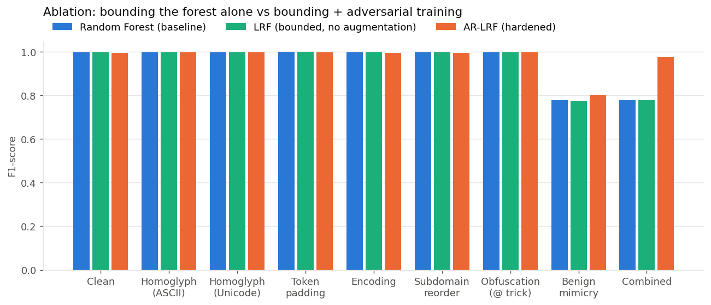

# AI Applications: Research Paper Study and Module Implementation

**Topic:** Adversarially-robust, lightweight phishing URL detection
**Paper studied:** *Adversarial-resilient lightweight phishing URL detection: Evaluating lexical & metadata features under evasion techniques*, Scientific Reports **16**, 26668 (July 2026). [nature.com/articles/s41598-026-60046-3](https://www.nature.com/articles/s41598-026-60046-3)
**Dataset used for the replication:** PhiUSIIL Phishing URL Dataset, UCI Machine Learning Repository #967
**Code:** this repository (`src/`), results in `results/`

---

## 1. Research paper study

### 1.1 Problem statement

Phishing is one of the most common and fastest-changing cyber threats. Attackers build URLs that imitate trusted brands to steal credentials and payment details. Machine-learning detectors report excellent accuracy in the literature, but almost all of them are evaluated only on *clean* data: the test URLs are the same kind of URLs the model was trained on.

Real attackers adapt. The paper points out that published models ignore **adversarial evasion**, meaning small, deliberate edits to a phishing URL that keep it working but push it across the decision boundary:

- **obfuscation** (e.g. the `user@host` trick),
- **encoding manipulation** (percent-encoding characters),
- **homoglyph substitution** (`paypal` → `paypa1`, or Cyrillic `а` for Latin `a`),
- **token padding** (adding trust words or junk tokens),
- **subdomain reordering**.

The question is: *how much does a lexical phishing detector degrade under these evasions, and can it be made resilient without becoming heavy?*

### 1.2 AI approach

The authors propose **AR-LRF (Adversarial-Resilient Lightweight Random Forest)**. It has two ingredients:

1. **Controlled ensemble complexity.** A Random Forest whose size and depth are bounded, so it stays fast and small enough for real-time or edge deployment.
2. **Adversarial training.** Simulated adversarial perturbations of URLs are added to the training data, so the forest learns decision rules that still hold when a URL has been manipulated.

A Random Forest is an ensemble of decision trees. Each tree is trained on a bootstrap sample of the data, using a random subset of features at each split, and the trees vote. That gives low variance, good accuracy on tabular features, fast inference, and built-in feature importances, which matter for interpretability in security tooling.

### 1.3 Data sources, features and evaluation

- **Data:** a large, imbalanced, real-world corpus of about **650,000 URLs**.
- **Features:** lexical, structural and metadata features derived from the URL. The paper deliberately avoids raw-URL deep models and deep packet inspection, which preserves privacy and keeps deployment cheap.
- **Metrics:** accuracy, precision, recall, F1 and ROC-AUC, on clean data and under each evasion technique. The key quantity is *performance degradation* from clean to attacked.
- **Headline result:** AR-LRF reaches **99.78% accuracy and ROC-AUC 0.9999 on clean data**, with significantly smaller degradation under adversarial perturbation than conventional models.

## 2. Conceptual understanding

### 2.1 Key components of the system

```
 raw URL ──► feature extractor ──► bounded Random Forest ──► P(phishing) ──► block / allow
                   ▲                        ▲
                   │                        │
          lexical / structural      trained on clean URLs
          features only             + adversarially perturbed URLs
          (no page fetch, no DPI)   (simulated evasions)
```

| Component | Role |
|---|---|
| Feature extraction | Turns the URL string into a fixed numeric vector (lengths, character counts and ratios, entropy, host properties) |
| Evasion simulator | Generates perturbed copies of phishing URLs that imitate attacker tricks |
| Bounded Random Forest | Lightweight classifier with depth and leaf limits |
| Robustness evaluation | Compares metrics on clean and perturbed test sets |

### 2.2 Modules that can be implemented practically

All of the following were implemented in this project:

1. **Data preprocessing:** download, label normalisation, de-duplication, stratified split (`src/data.py`).
2. **Feature extraction:** 29 lexical features computed from the URL string only (`src/features.py`).
3. **Evasion attacks:** 7 attacks plus one combined attack (`src/attacks.py`).
4. **Model training:** baseline classifiers and the hardened AR-LRF (`src/experiment.py`).
5. **Prediction and demo:** a command-line scorer (`src/predict.py`).

## 3. Implementation

### 3.1 Dataset: PhiUSIIL

PhiUSIIL (Prasad & Chandra, 2024) contains 235,795 URLs (134,850 legitimate, 100,945 phishing). The CSV ships with 50+ pre-computed features, some of which require fetching the web page (HTML lines, forms, iframes). **Only the `URL` and `label` columns are used.** Every feature is recomputed from the URL string, because:

- it matches the paper's lightweight, no-page-fetch setting, and
- an adversarial edit to the URL must actually change the features. Pre-computed columns would not change when the URL is attacked.

The original label uses `1 = legitimate`. It is flipped so that **`1 = phishing`**, which makes *recall = phishing detection rate*. After removing duplicate URLs, the data is split 80/20 with stratification (seed 42).

### 3.2 Features (29, all lexical)

| Group | Features |
|---|---|
| Length | `url_len`, `host_len`, `path_len`, `query_len`, `tld_len`, `longest_token` |
| Character counts | `n_dots`, `n_hyphens`, `n_underscores`, `n_slashes`, `n_digits`, `n_special`, `n_percent_enc`, `n_non_ascii`, `host_hyphens` |
| Ratios | `digit_ratio`, `letter_ratio`, `special_ratio`, `host_digit_ratio` |
| Host properties | `host_is_ip`, `has_port`, `n_subdomains`, `has_www`, `has_punycode`, `has_at` |
| Other | `is_https`, `n_query_params`, `n_suspicious_words` (login, verify, secure, ...), `entropy` (Shannon entropy of the URL) |

Extracting features for all 235k URLs takes a few seconds in pure Python.

### 3.3 Evasion attacks

Attacks are applied **only to phishing URLs in the test set**. Legitimate test URLs stay unchanged, because the attacker controls their own phishing URL, not other people's sites. Each attack keeps the URL functional from the attacker's side: they own the domain, so they can register look-alike names, add subdomains and serve the page under any path.

| Attack | Example | Paper family |
|---|---|---|
| `homoglyph_ascii` | `paypal.com` → `paypa1.com` | homoglyph substitution |
| `homoglyph_unicode` | `paypal.com` → `рaypal.com` (Cyrillic `р`, `а`) | homoglyph substitution |
| `token_padding` | `evil.com` → `secure-login-verify.evil.com` | token padding |
| `encoding` | `/signin` → `/%73%69%67%6E%69%6E` | encoding manipulation |
| `subdomain_reorder` | `a.b.evil.com` → `b.a.evil.com` | subdomain reordering |
| `obfuscation` | `http://www.google.com@evil.com/` | obfuscation |
| `benign_mimicry` | `http://evil.com/x` → `https://www.evil.com/x` | (added) imitate the typical legitimate URL |
| `combined` | homoglyph_unicode → subdomain_reorder → benign_mimicry | chained |

`benign_mimicry` is not in the paper's list. It was added after inspecting the dataset (Section 4.1): it is the cheapest change a real attacker can make (a free TLS certificate and a `www` record) and it targets this dataset's strongest bias.

### 3.4 Models

| Model | Configuration | Purpose |
|---|---|---|
| Logistic Regression | standardised features | linear baseline |
| Decision Tree | `max_depth=15` | single-tree baseline |
| **Random Forest (baseline)** | 100 trees, unbounded depth, clean data only | the model being attacked |
| LRF (ablation) | 100 trees, `max_depth=20`, `min_samples_leaf=2`, clean data only | isolates the effect of bounding the forest |
| **AR-LRF (hardened)** | same bounded forest + one adversarial copy of every training phishing URL (attack chosen at random from the 7 base attacks) | the paper's approach |

The `combined` attack is never used for augmentation. For a fairer generalisation test, a **leave-one-attack-out** study retrains AR-LRF with one attack removed from augmentation and evaluates on that unseen attack.

## 4. Results

All numbers below come from `results/metrics.json` and `results/robustness.csv`, produced by one run of `python src/experiment.py`. The test set has 47,074 URLs (20,104 phishing, 26,970 legitimate), the training set 188,296. Seeds are fixed, so re-running gives the same numbers.

### 4.1 Before modelling: the dataset has a shortcut


| | uses https | has `www.` | has a path |
|---|---|---|---|
| Legitimate | **100%** | **100%** | **0%** |
| Phishing | 49% | 42% | 27% |

Every legitimate URL in PhiUSIIL is a bare homepage of the form `https://www.<domain>`, with no path and not even a trailing slash. Phishing URLs are far more varied. As a result, a depth-3 decision tree that sees **only `is_https`, `has_www` and `path_len`** already scores:

| Shortcut model (3 features) | Accuracy | Precision | Recall | F1 |
|---|---|---|---|---|
| Decision tree, depth 3 | 0.9975 | 1.0000 | 0.9942 | 0.9971 |

So most of the near-perfect clean accuracy reported on this dataset comes from the *shape* of the URL, not its content. This finding drives the rest of the evaluation: an attacker who copies that shape should be able to evade the model, which is why the `benign_mimicry` attack was added.

### 4.2 Clean test performance

| Model | Accuracy | Precision | Recall | F1 | ROC-AUC | Train time | Inference |
|---|---|---|---|---|---|---|---|
| Logistic Regression | 0.9976 | 0.9999 | 0.9946 | 0.9972 | 0.9987 | 1.7 s | 1.0 µs/URL |
| Decision Tree (depth 15) | 0.9978 | 0.9992 | 0.9956 | 0.9974 | 0.9978 | 1.5 s | 0.3 µs/URL |
| **Random Forest (baseline)** | **0.9979** | 0.9994 | 0.9958 | **0.9976** | 0.9983 | 21 s | 11.8 µs/URL |
| LRF (bounded, no aug.) | 0.9981 | 0.9999 | 0.9956 | 0.9977 | 0.9987 | – | – |
| **AR-LRF (hardened)** | 0.9970 | 0.9970 | 0.9960 | 0.9965 | 0.9987 | 27 s | – |

*Inference time is the batch prediction time on the test set divided by the number of URLs, from a single run on a laptop CPU.*

This is close to the paper's clean result (99.78% accuracy, AUC 0.9999). The saved models are small: the compressed Random Forest is 3.8 MB and AR-LRF 4.4 MB.

### 4.3 Under attack: clean vs attacked vs hardened


Phishing recall (detection rate) on the test set. Only the phishing URLs are attacked.

| Scenario | URLs changed | RF baseline | LRF (bounded) | **AR-LRF (hardened)** |
|---|---|---|---|---|
| Clean | – | 0.9958 | 0.9956 | 0.9960 |
| Homoglyph (ASCII) | 74% | 0.9961 | 0.9961 | 0.9970 |
| Homoglyph (Unicode) | 91% | 0.9958 | 0.9956 | 0.9994 |
| Token padding | 100% | 1.0000 | 1.0000 | 1.0000 |
| Encoding | 27% | 0.9958 | 0.9956 | 0.9960 |
| Subdomain reorder | 13% | 0.9958 | 0.9956 | 0.9960 |
| Obfuscation (`@` trick) | 100% | 0.9957 | 0.9957 | 1.0000 |
| **Benign mimicry** | 98% | **0.6359** | 0.6352 | **0.6736** |
| **Combined** | 100% | **0.6355** | 0.6352 | **0.9536** |

F1-score, including the bounded-forest ablation:



| Scenario | RF baseline F1 | AR-LRF F1 | RF baseline AUC | AR-LRF AUC |
|---|---|---|---|---|
| Clean | 0.9976 | 0.9965 | 0.9983 | 0.9987 |
| Benign mimicry | 0.7772 | 0.8035 | 0.8474 | 0.8965 |
| Combined | 0.7769 | 0.9748 | 0.8470 | 0.9943 |

What the numbers show:

1. **Five of the paper's attack families do not hurt this model.** Homoglyphs, token padding, percent-encoding, subdomain reordering and the `@` trick all *add* characters, digits, hyphens or symbols. Because every legitimate URL in this dataset is minimal, anything that adds structure pushes a URL towards "phishing". Token padding even raises recall to 1.0.
2. **Benign mimicry is devastating.** Forcing `https://` and adding `www.` drops the baseline's recall from **99.6% to 63.6%**: about 7,300 of 20,104 phishing URLs now pass as legitimate. The cost to the attacker is a free TLS certificate and one DNS record.
3. **Hardening fixes the combined attack but not mimicry.** AR-LRF recovers the combined attack from 63.6% to **95.4%** recall, but mimicry only from 63.6% to **67.4%**. Section 4.5 explains why.
4. **Bounding the forest alone does nothing for robustness.** The LRF column is almost identical to the baseline. All of AR-LRF's gain comes from adversarial training, not from limiting complexity, which only buys a smaller and faster model.
5. **Hardening has a small cost.** AR-LRF's false positives on clean legitimate URLs go from 13 to 61 out of 26,970 (precision 0.9994 → 0.9970).

### 4.4 Confusion matrices and ROC


On clean data both models have a near-perfect ROC curve. Under the hardest attack (benign mimicry), AUC falls to 0.847 for the baseline and 0.897 for AR-LRF. The dashed curves show that no threshold choice can recover the lost phishing URLs without a large false-positive rate. The problem is in the features, not in the threshold.

### 4.5 Why mimicry cannot be trained away

After mimicry, **40%** of the attacked phishing test URLs are a bare `https://www.<domain>`, exactly the shape of all 134,850 legitimate URLs. For these, the only evidence left is the domain name string itself.

| Model | Recall: bare-domain phishing | Recall: phishing with a path | Overall mimicry recall | Clean false-positive rate |
|---|---|---|---|---|
| RF baseline | 9.2% | 100% | 63.6% | 0.05% |
| AR-LRF (1 random attack per URL) | 18.6% | 100% | 67.4% | 0.23% |
| LRF trained with mimicry on *every* phishing URL | 34.4% | 100% | 73.7% | **2.79%** |

Even a model that has seen the mimicked form of every training phishing URL catches only about a third of bare-domain phishing, and it pays with a 12× higher false-positive rate. Lexical features such as length, digit ratio, entropy and TLD cannot reliably separate `https://www.dfuimiubaifhimoofmfpbmdjjedaaphs.top` from `https://www.ecolabelindex.com` once the structural giveaways are gone. This is a **limit of the feature space, not of the classifier**.

### 4.6 Does hardening generalise to unseen attacks? (leave-one-attack-out)


| Held-out attack | RF baseline | AR-LRF, attack held out | AR-LRF, attack seen |
|---|---|---|---|
| Homoglyph (ASCII) | 0.9961 | 0.9969 | 0.9970 |
| Homoglyph (Unicode) | 0.9958 | 0.9961 | 0.9994 |
| Token padding | 1.0000 | 1.0000 | 1.0000 |
| Encoding | 0.9958 | 0.9962 | 0.9960 |
| Subdomain reorder | 0.9958 | 0.9962 | 0.9960 |
| Obfuscation | 0.9957 | 0.9977 | 1.0000 |
| **Benign mimicry** | 0.6359 | **0.6391** | 0.6736 |

When mimicry is left out of the augmentation set, AR-LRF is no better than the untrained baseline on it (0.639 vs 0.636). **Adversarial training only protects against the perturbations it was shown**, which is the main practical weakness of this defence. A real attacker will try transformations the defender did not think of.

### 4.7 Interpretation: feature importance


The baseline puts **41% of its total importance on `is_https`** and roughly a third on `n_slashes`, `path_len` and `has_www`, which are the same structural shortcut seen in Section 4.1. AR-LRF shifts some weight towards content features (`n_special`, `digit_ratio`, `host_digit_ratio`, `n_hyphens`, `entropy`), but the shortcut features still dominate. The interpretability of Random Forests is what exposed this weakness.

### 4.8 Demonstration

`python src/predict.py --attacks <url>` scores a URL and all its evasion variants with both models. Selected rows from `results/demo_predictions.csv` (P = probability of phishing):

| URL | Attack | P (RF) | P (AR-LRF) |
|---|---|---|---|
| `http://www.dfuimiubaifhimoofmfpbmdjjedaaphs.top` | clean | 0.98 | 0.99 |
| `https://www.dfuimiubaifhimoofmfpbmdjjedaaphs.top` | benign mimicry | **0.01** | **0.22** |
| `https://www.dfuimiubаifhimооfmfрbmdjjеdаарhs.top` | combined | **0.00** | 0.64 |
| `http://www.institutohumanus.org.br` | clean | 1.00 | 0.99 |
| `https://www.institutohumanus.org.br` | benign mimicry | **0.00** | **0.07** |
| `http://paypal.com.secure-update.info/login` | clean | 1.00 | 1.00 |
| `https://www.paypal.com.secure-update.info/login` | benign mimicry | 1.00 | 1.00 |
| `https://www.wikipedia.org` | clean | 0.01 | 0.03 |
| `https://www.wikiреdiа.org` (Cyrillic р, е, а) | homoglyph | **0.00** | **0.93** |

Example CLI run on a made-up phishing URL with a path. It survives every attack, because a path alone marks a URL as phishing in this dataset:

```text
$ python src/predict.py --attacks "http://evil-login.com/acct"
variant                      RF       AR-LRF  url
clean               PHISH  1.00  PHISH  1.00  http://evil-login.com/acct
homoglyph_ascii     PHISH  0.99  PHISH  1.00  http://ev11-10g1n.com/acct
homoglyph_unicode   PHISH  1.00  PHISH  1.00  http://еvil-lоgin.com/acct
token_padding       PHISH  1.00  PHISH  1.00  http://secure-login-verify.evil-login.com/acct
encoding            PHISH  1.00  PHISH  1.00  http://evil-login.com/%61%63%63%74
subdomain_reorder   PHISH  1.00  PHISH  1.00  http://evil-login.com/acct
obfuscation         PHISH  1.00  PHISH  1.00  http://www.google.com@evil-login.com/acct
benign_mimicry      PHISH  1.00  PHISH  1.00  https://www.evil-login.com/acct
combined            PHISH  1.00  PHISH  1.00  https://www.еvil-lоgin.com/acct
```

- Two real phishing URLs from the test set flip to "legitimate" just by adding `https://www.`. AR-LRF catches neither.
- A phishing URL with a telling path (`/login`, brand in subdomain) survives every attack.
- The **Wikipedia homograph** is the clearest win for adversarial training. The baseline calls `wikiреdiа.org` legitimate (0.00), while AR-LRF flags it (0.93) because it learned that non-ASCII characters in a domain are a phishing signal.

## 5. Discussion

**Comparison with the paper.** The replication matches the paper's clean performance (99.79% vs 99.78% accuracy) and confirms its core claim: adversarial training improves robustness against the perturbations it was trained on (combined attack: 63.6% → 95.4% recall; Unicode homoglyph: 99.58% → 99.94%). It also confirms that a bounded forest stays lightweight: microseconds per URL and a few MB on disk.

**Where the replication disagrees.** Most of the paper's named evasion families barely moved this model, because on PhiUSIIL they make phishing URLs look *more* suspicious, not less. The attack that actually worked, structural mimicry of legitimate URLs, is one that adversarial training could not fix, because the information needed to separate the classes is no longer in the lexical features. Evasion robustness depends on the dataset: a defence evaluated against attacks that the dataset already makes conspicuous will look stronger than it is.

**Why the combined attack is easier than mimicry alone.** Combined = Unicode homoglyph + reorder + mimicry. The homoglyph step leaves non-ASCII characters in the domain, which AR-LRF learned to treat as a strong phishing signal. In a real browser, such a domain becomes punycode (`xn--...`), which is also a feature. Stacking evasions can *add* detectable artefacts.

## 6. Limitations

1. **Dataset bias.** Legitimate URLs in PhiUSIIL are all bare homepages, while real legitimate traffic includes deep links (`/account/settings?tab=2`). The clean 99.8% figure would not survive deployment, and a model trained here would likely flag many real legitimate deep links. A fair evaluation needs legitimate URLs with paths, for example crawled internal links of top sites.
2. **Lexical features have a ceiling.** Once a phishing URL looks like a normal homepage, lexical features cannot separate it (Section 4.5). Closing the gap needs non-lexical signals: domain age and WHOIS data, certificate transparency logs, DNS reputation, or page content and visual similarity to known brands.
3. **Adversarial training is attack-specific.** It protects against the perturbations it has seen and does not generalise to a new one (Section 4.6). It is also an arms race: the defender must anticipate every transformation.
4. **Attacks are rule-based, not optimised.** The evasions are fixed string edits. An adaptive attacker who queries the model and searches for the cheapest flipping edit (black-box optimisation) would do at least as well as `benign_mimicry`.
5. **Functionality assumptions.** The attacks assume the attacker controls the domain and server. Some edits, such as homoglyph domains, require registering a new domain, and registrars or browsers may block mixed-script names.
6. **Simplified replication.** The paper's dataset (650k URLs), exact feature set, metadata features and hyperparameters are not reproduced. The AR-LRF here follows the paper's description (bounded forest plus simulated perturbations in training) rather than its exact configuration.

## 7. Conclusion

A Random Forest on 29 lexical URL features reaches 99.8% accuracy on PhiUSIIL, matching the paper's clean result. Under evasion, the picture changes:

- Most textbook evasions (homoglyphs, padding, encoding, reordering, `@` obfuscation) do not hurt it on this dataset.
- A trivial structural mimicry attack (`https://www.` prefix) cuts phishing recall from 99.6% to 63.6%.
- Adversarial training in the AR-LRF style recovers the combined attack (95.4%) at a small false-positive cost.
- It cannot recover mimicry (67.4%), and it does not generalise to attacks left out of training.

Classical models are fast, small and interpretable. That interpretability is how the shortcut was found. But on their own, lexical features are not robust against an attacker who copies the shape of legitimate URLs.

## 8. Reproducing

```bash
pip install -r requirements.txt
python src/experiment.py            # ~13 min on a laptop CPU; downloads data on first run
python src/predict.py --attacks "http://evil-login.com/acct"
python -m pytest -q tests           # unit tests for features and attacks
```

| Output | Content |
|---|---|
| `results/metrics.json` | every number in this report |
| `results/robustness.csv` | per-scenario × per-model accuracy, precision, recall, F1, AUC |
| `results/demo_predictions.csv` | demo URLs and their scores |
| `results/feature_importance.csv` | feature importances for both forests |
| `results/figures/*.png` | all figures |

## References

1. *Adversarial-resilient lightweight phishing URL detection: Evaluating lexical & metadata features under evasion techniques.* Scientific Reports 16, 26668 (2026). https://www.nature.com/articles/s41598-026-60046-3 (PubMed 42410088)
2. A. Prasad and S. Chandra. *PhiUSIIL: A diverse security profile empowered phishing URL detection framework based on similarity index and incremental learning.* Computers & Security 136 (2024). Dataset: UCI Machine Learning Repository #967, https://archive.ics.uci.edu/dataset/967
3. *A Lightweight Hybrid MLP-Based Framework for Real-Time Phishing URL Detection Using Structural URL Features.* arXiv:2606.00889 (2026). Uses PhiUSIIL as a benchmark.
4. L. Breiman. *Random Forests.* Machine Learning 45, 5–32 (2001).
5. F. Pedregosa et al. *Scikit-learn: Machine Learning in Python.* JMLR 12, 2825–2830 (2011).
